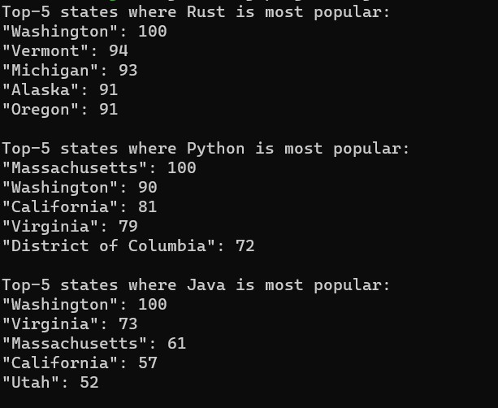
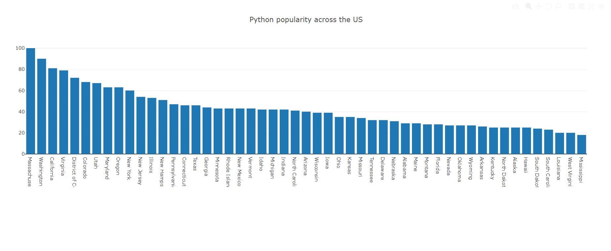
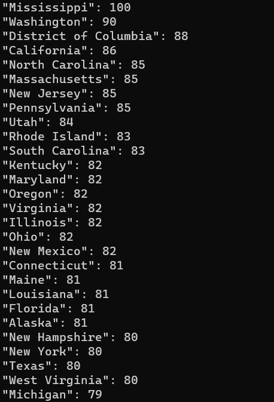

# Programming Trends

## Motivation
The goal of this project is to analyze google search trends to determine what is currently hot in the programming world and what may be dying off or up and coming. This project uses [Google Trends](https://trends.google.com/trends/?geo=US) using the [rtrend](https://crates.io/crates/rtrend) package in rust, which is an unnoficial API for interacting with Google Trend.

## Understanding the Output
### Printed Output
Currently the program is looking at the popularity of the Rust programming language in each state, and printing out the results. The largest possible score is 100 and this means that is the state where Rust is most commonly searched (and therefore likely most popular). A score of 50 indicates that Rust is half as popular in that state compared to the state with a score of 100. Finally, a score of 0 does not mean there are not any searches at all, it just means there is not enough data to make any meaningful conclusions. 

### Graph
The program also creates a directtory called `results`and places graphs in html format for each of the languages. You can view and interact with these graphs using any modern browser. This contains the same information described above, but in the form of a bar chart which may be easier for some people to understand or compare between states. 

## Running the CLI
There are two different ways to run this program. The first is to compare the popularity of different langauges across the united states, and the second is to focus on one programming language at a time and get more complete results. Regardless of how you want to run the program, it should be run from the `programming-trends` directory.

### Language Comparison
This is the default option and compares five different languages: `Rust`, `Python`, `C`, `Java`, and `Javascript`. For each language, the top-5 states where the language is most popular is printed to the terminal. A graph visualization is also output to the results folder, which will be created if it doesn't exist already. An example of a terminal output and graph are shown below:

To run the program, do the following:
1) cd into `programming-trends`
2) run the command `cargo run`

### Single Language Output
The single language option allows you to dive deeper into a single programming language. Instead of printing the top-5 states where the programming language is popular, it will print all the states to the terminal. It will also update the graph in the `results` folder. An example of the different terminal output is shown below:

To run the program in single language analysis mode, do the following:
1) cd into `programming-trends`
2) Choose a langauge from the following: `Rust`, `Python`. `Java`, `C`, and `Javascript`.
3) run the command `cargo run -- single --language [LANGUAGE_CHOICE]`. An example is `cargo run -- single --language Rust``

# Working with the rtrend crate
The documentation for the rust rtrend crate can be found [here](https://crates.io/crates/rtrend). I also found an article using the python equivalent library to be very helpful in understanding more details about how the Google Trends API generally works. That article can be found [here](https://towardsdatascience.com/google-trends-api-for-python-a84bc25db88f).
